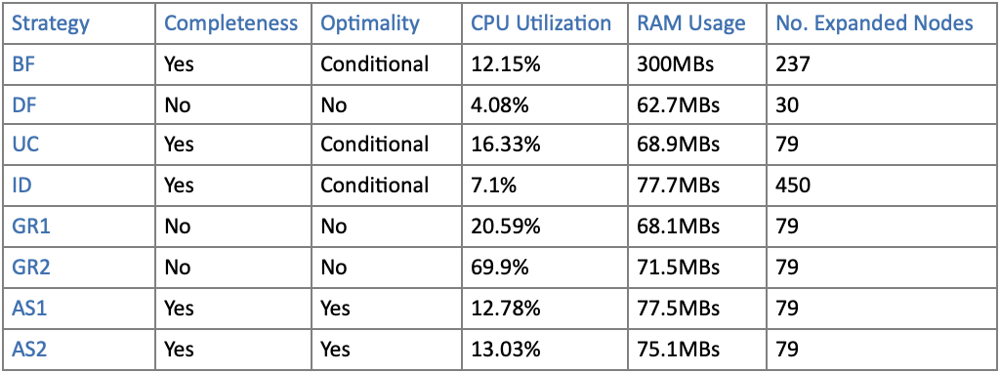

# AI Bot

This project is part of Inroduction to Artificial Intelligence course to demonstrate the implementation of below search algorithms using JAVA 8;

1- Breadth-First Search
2- Depth-First Search
3- Iterative Deepening Search
4- Uniform Cost Search
5- Greedy Search with at least two heuristics.
6- A* Search with at least two admissible heuristics

Each of the aforementioned strategies were tested and compared in terms of RAM usage, CPU utilization, and the number of search tree nodes expanded.

How search algorithms were implemented:

We first started by creating a searchQueue using a linked list for the nodes being expanded.
A hashset for the repeated nodes. We pass the grid to the initial state to create the root node, and the root node is added to search queue. We add the state to the hashset.

Breadth-First:

The current strategy loops as long as the search queue is not empty to dequeue the front of the queue  checks for goal state  returns the current node if it is a goal state, and if not, it expands the node using the returned valid operators. We check in the repeated nodes hashset for each new state generated. The unrepeated nodes are enqueued last to the rear of the queue. If a newly expanded node was found in the hashset it will not be enqueued in the queue.

Depth-First:

The current strategy loops as long as the search queue is not empty to dequeue the front of the queue  checks for goal state  returns the current node if it is a goal state, and if not, it expands the node using the returned valid operators. We check in the repeated nodes hashset for each new state generated. The unrepeated nodes are enqueued to the front of the queue. If a newly expanded node was found in the hashset it will not be enqueued in the queue.

Iterative deepening:

The current strategy loops as long as the search queue is not empty to dequeue the front of the queue  checks for goal state  returns the current node if it is a goal state, and if not, it expands the node using the returned valid operators  checks for the depth of each newly expanded node  if the depth of the newly expanded node is greater than the current depth we are working on  We clear the hashset of the repeated nodes, increment the depth Start over.

Uniform Cost:

The current strategy loops as long as the search queue is not empty to dequeue the front of the queue  checks for goal state  returns the current node if it is a goal state, and if not, it expands the node using the returned valid operators Adds the path cost to each newly generated node using the cost function We check in the repeated nodes hashset for each new state generated The unrepeated nodes are enqueued using the order returned by sortSearchQueue method which sorts according to the path cost of each node.

Greedy:

The greedy strategy is applied twice: once using heuristic1 method which sorts the search queue according to this specific heuristic, and once using heuristic2 method which sorts the search queue according to this specific heuristic.

A\*:

The A\* strategy is applied twice: once using heuristic 1 added to the path cost value returned from cost function sorts the search queue according the values returned from the cost function which is the sum of h1 and the path cost, and once using the heuristic 2 added to the path cost value returned cost function  sorts the search queue according the values returned from the cost function which is the sum of h2 and the path cost.

Heuristic functions used and their admissibility in the case of A\*
The two used heuristic functions are admissible as they never overestimate the cost to reach the goal, it is always less than or at most equals to the the actual path cost from our current node to the close goal
i.e., Heuristic one calculates the pathCost from node n to the closest goal and divides it by 3 and heuristic two calculates the pathCost from none n to the closest goal and divides it by 9

Comparison of performance between the search strategies (Completeness, optimality, RAM Usage, CPU Utilization, Number of expanded nodes)
Running each strategy on grid0:

Discussion of anything that doesn't run
Grids 3,9 time out when running the following strategies: UC,GR1,GR2,AS1,AS2.
Some of these errors are due to Neo being stuck in an infinite loop and others run successfully when given more time.

Node class implementation
(Explain attributes of the class along with the constructors and functions and their functionalities)
In this class (Node), we introduced the following parameters:

NeoState:
A string that contains the current situation of the grid at this specific node

ParentNode:
A reference to the previous node

depth:
Depth of the node in the tree

pathCost:
Cost of expanding the node

heuristic:
Heuristic for this node

prevOp:
Operator the led to this node

We implemented:
Setters and getters for NeoState to be able to retrieve its data or change it throughout the search process.
Getter to retrieve the parent node to be used when needed.
Getter to retrieve the prevOp to be used when constructing the plan.

Matrix Class Implementation (Brief explanation of each function in their order)
Initialization of some global static variables to be used whenever needed in the code.

String genGrid():

A method for generating a grid of random size between 5*5 and 15*15 and calls the following helper functions in order to generate the objects in the grid with no overlap.
String genNeo()
String genTele()
void genHost()
void genPill()
void genPads()
void genAgents()

String solve (String grid, String strategy, Boolean visualize):
Reinitializes plan, Number of expanded nodes, deaths, kills and repeated nodes.
Add all operators available to operators arraylist and returns the result of GeneralSearch function in a node and finally returns the solution.

Node InitialState(String grid):
Takes the grid as input and constructs the Initial State by taking substrings from the grid string. Uses this initial state to create root node and returns it.

Node GeneralSearch (String grid, String strategy, ArrayList<String> Operators):
Initializes the search queue and retrieves root node by calling the initialstate() method.
Adds root node to search queue initially and adds the state from the root node to the repeatedNodes Hashset to avoid infinite looping on a state.
Checks on the strategy being used and according to the given strategy, either calls a helper function to execute the search algorithm or executes the strategy right away in the existing function.

Helper functions the can be called:
void BreadthFirst(LinkedList<Node> SearchQueue, Node node)
void DepthFirst(LinkedList<Node> SearchQueue, Node node)

void sortSearchQueue(LinkedList<Node> SearchQueue, Node newNode):
Called by the strategies the use cost/heuristics to sort the nodes according to their cost in the SearchQueue.

int Cost(Node node):
Calculate the cost of a specific node that’s being passed to it.

ArrayList<String> illegalOps(Node currentNode, ArrayList<String> Operators):
A method that checks on the currentNode and returns all the available operators that can be applied on this node (Handles illegal moves).

String Move(String Op, Node currentNode):
This function applies all the legal operators returned from illegalOps on the current node and returns the new state resulting from each operators.

boolean goaltest(Node node):
This function checks if a node is a goal state and return true if so.

int heuristic1(Node node):
This function applies the greedy strategy and h(n) to the cost. The h(n) was calculated by multiplying the kills by a big number, and the deaths by a smaller number, and then adding them together. The previously calculated number is then divided by 3. We calculate the Manhattan distance by taking the absolute values of the difference between the X-coordinates of neo and the X-coordinate of the telephone booth added to the difference of the Y-coordinate of Neo and the Y-coordinate of the telephone booth. The previous calculation is used to check for the 0 distance also considered as the base case.

int heuristic2(Node node):
This function applies the greedy strategy and h(n) to the cost. The h(n) was calculated by multiplying the kills by a big number, and the deaths by a smaller number, and then adding them together. The previously calculated number is then divided by 9. We calculate the Manhattan distance by taking the absolute values of the difference between the X-coordinates of neo and the X-coordinate of the telephone booth added to the difference of the Y-coordinate of Neo and the Y-coordinate of the telephone booth. The previous calculation is used to check for the 0 distance also considered as the base case.
